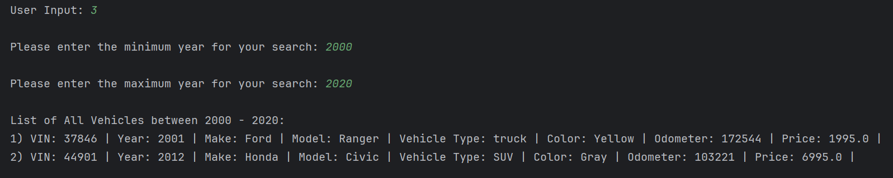
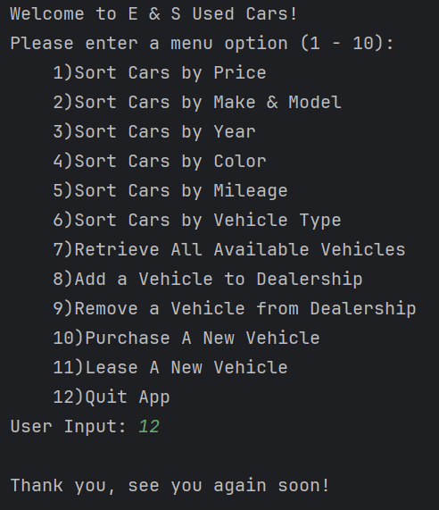

# E & S Used Cars Dealership System

## **Created by: Erik Holden and Sing Tuttanon**

## Table of Contents:

- [Project Description](#project-description)
- [Project Structure](#project-structure)
    - [Vehicle](#vehicle)
    - [Dealership](#dealership)
    - [DealershipFileManager](#dealershipfilemanager)
    - [UserInterface](#userinterface)
    - [WorkshopApp](#workshopapp-main)
    - [Contract](#contract)
    - [ContractFileManager](#contractfilemanager)
    - [LeaseContract](#leasecontract)
    - [SalesContract](#salescontract)
- [Functionality](#funcionality)

## Project Description

In this Exercise, we utilized collaborative efforts in constructing an application geared toward managing a dealership's data efficiently.

## Project Structure

### **Java Classes: Part 1**

#### Vehicle
- Represents specific data of vehicles within the inventory.
    - Contains properties related to a specific vehicle.
    - Getters and Setters for vehicle properties.

#### Dealership
- Represents dealership's information.
    - Manages dealership information (Name, Address,... etc.).
    - Manages vehicle data.
        - Search function (Search by Vehicle... Price, Make and Model, Year, Color, Mileage, and Type)
        - Adding and Removing vehicle data.
        - Retrieving vehicle data

#### DealershipFileManager
- Manages reading and writing dealership-related data.
    - Loads and Saves dealership and vehicle data "to" and "from" the csv file.

#### UserInterface
- Manages user interactions and vehicle data display.
    - Processes user input(s).
    - Moderates the flow of the application based on user input(s).

#### WorkshopApp (Main)
- Entry point of the application.
- Initializes the application, pulling from the "UserInterface".

### **Java Classes: Part 2**

#### Contract
- Represents the base class for contracts.
  - Containing properties and methods for lease and sales contracts.

#### ContractFileManager
- Manages reading and writing contract-related data.
  - Loads and Saves contract data "to" and "from" the csv file.

#### LeaseContract
- Represents a lease contract for a vehicle.
  - Calculates total price and monthly payment.

#### SalesContract
- Represents a sales contract for vehicles.
  - Calculates total price and monthly payment.

## Functionality
### **Welcome Screen:**

Welcome to E & S Used Cars!

Please enter a menu option (1 - 10):
1) Sort Cars by Price
2) Sort Cars by Make & Model
3) Sort Cars by Year
4) Sort Cars by Color
5) Sort Cars by Mileage
6) Sort Cars by Vehicle Type
7) Retrieve All Available Vehicles
8) Add a Vehicle to Dealership
9) Remove a Vehicle from Dealership
10) Purchase A New Vehicle
11) Lease A New Vehicle
12) Quit App

User Input:

The following functions encompass accessing and managing the dealership's interface.

1. **Search vehicles by Price Range** -Find vehicles available within a specified price range.

2. **Search vehicles by Make and Model** - Find vehicles based on their make and model.

3. **Search vehicles by Year Range** - Find vehicles within a specified year range.

4. **Search vehicles by Color** - Find vehicles based on the specified color.

5. **Search vehicles by Mileage Range** - Find vehicles within a specified mileage range.

6. **Search vehicles by Type** - Find vehicles based on their type.

7. **Display all vehicle listings** - Display a list of all vehicles registered.

8. **Vehicle Addition** - Add a new vehicle to the dealership data system.

9. **Vehicle Removal** - Remove a vehicle from the dealership data system.

10. **Vehicle Purchasing** - Initiate a sales contract for purchasing a new vehicle.

11. **Vehicle Leasing** - Initiate a lease contract for leasing a new vehicle.

12. **Exit Application** - Closes the application.

